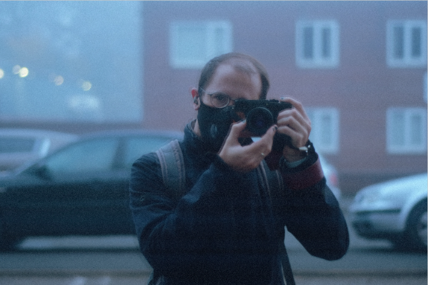

{{site.about}}

{:class="img-responsive"}

Hi, I'm Innes. A software engineer living in York.

Day to day I work with a variety of technologies (primarily back-end and
scripting) in order to facilitate a dev-ops workflow for other developers.

Outside of work I'm a photographer, amateur Physicist and Mathematician
([helping Dr John Williamson][1] with his theory of [Absolute Relativity][2])
and general nerd. I live in York with my amazing wife [Katie][3] and our two
wonderful/trouble making daughters.

> I.D.A_M

-----------------

email:      [innes.andersonmorrison](mailto:innes.andersonmorrison@gmail.com) 
keybase:    [profile](https://keybase.io/idam), [verification for this site](https://sminez.github.io/keybase.txt) 
quicycle:   [Computational Tools](https://quicycle.com/index.php/computational-tools/) 
github:     [sminez](https://github.com/sminez/) 
linkedIn:   [Innes Anderson-Morrison](https://www.linkedin.com/in/innes-anderson-morrison-4a67b1b9/) 
twitter:    [@I_D_A_M](https://twitter.com/I_D_A_M) 
instagram:  [innes_photo](https://www.instagram.com/innes_photo/) 
flickr:     [sminez](https://www.flickr.com/photos/sminez/) 
soundcloud: [Sminez](https://soundcloud.com/innes-anderson-morrison)

-----------------

  [0]: https://cocoon.life/
  [1]: https://github.com/sminez/arpy
  [2]: https://quicycle.com/
  [3]: http://www.katieanderson-morrison.com/
