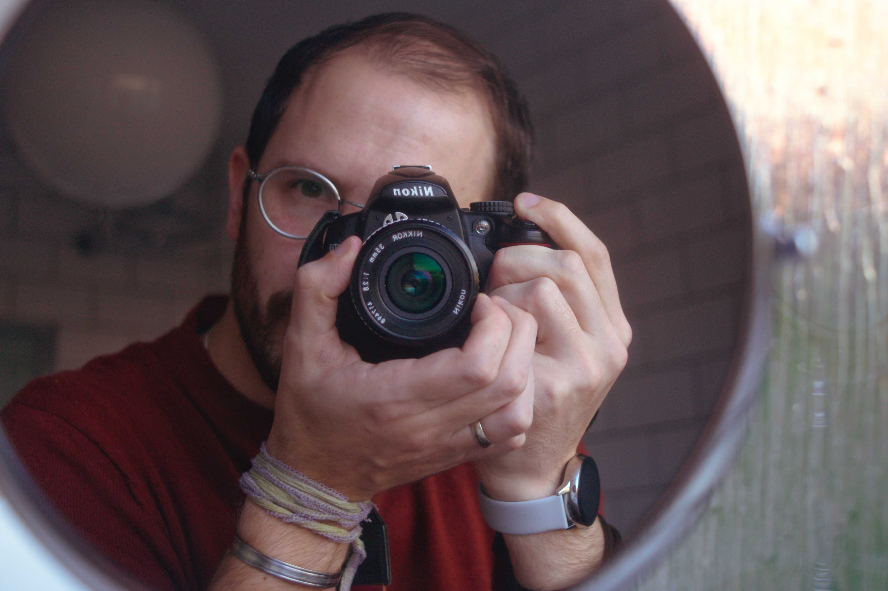

{{site.about}}

{:class="img-responsive"}

Hi, I'm Innes. A former software engineer and "data guy" over at
[Cocoon Labs][0] in Leeds and Software developer for [SEI-Y][4] in York. Now I
work at [Anaplan][5].

Day to day I work on a variety of projects, supporting the research being
carried out by colleagues based here in York and further afield.

Outside of work I'm a photographer, amateur Physicist and Mathematician
([helping Dr John Williamson][1] with his theory of [Absolute Relativity][2])
and general nerd. I live in York with my amazing wife [Katie][3] and our two
wonderful/trouble making daughters.

> I.D.A_M

-----------------

email:     [innes.andersonmorrison](mailto:innes.andersonmorrison@gmail.com) 
keybase:   [profile](https://keybase.io/idam), [verification for this site](https://sminez.github.io/keybase.txt) 
sei:       [Staff Profile](https://www.sei.org/people/innes-anderson-morrison/) 
github:    [sminez](https://github.com/sminez/) 
gitlab:    [sminez](https://gitlab.com/sminez) 
linkedIn:  [Innes Anderson-Morrison](https://www.linkedin.com/in/innes-anderson-morrison-4a67b1b9/) 
twitter:   [@I_D_A_M](https://twitter.com/I_D_A_M) 
flickr:    [sminez](https://www.flickr.com/photos/sminez/) 
instagram: [i.d.a_m](https://www.instagram.com/idam_daily_photo/) 

-----------------

  [0]: https://cocoon.life/
  [1]: https://github.com/sminez/arpy
  [2]: http://eprints.gla.ac.uk/110966/1/110966.pdf
  [3]: http://www.katieanderson-morrison.com/
  [4]: https://www.york.ac.uk/sei/
  [5]: https://www.anaplan.com/
