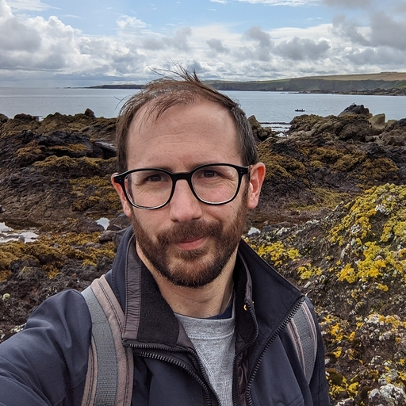

+++
title = "About Me"
path = "about"
date = 2024-04-29
+++

Hi, I'm Innes! I'm a software engineer, photographer and general all around nerd. I have a habit of
telling people that I enjoy having hard problems to solve and then wondering why a lot of my time is
taken up solving hard problems.

For my day job I've worked for and with a variety of interesting people writing software and helping to
improve the way that people go about their day to day (details can be found on [LinkedIn][0] if that's
your sort of thing but I'm not very active there).

When I'm on my own time I have a very low tolerance for being bored so you'll often find me working on
my own [open source projects][1], taking [photographs][2] and helping physicists with hypercomplex
algebra and their associated [research][3].

 

-----------------

:key: keybase:          [idam](https://keybase.io/idam) ([verification for this site](https://sminez.github.io/keybase.txt)) 
:elephant: mastodon:    <a rel="me" href="https://hachyderm.io/@sminez">@sminez@hachyderm.io</a> 
:mailbox: email:        [innes.andersonmorrison](mailto:innes.andersonmorrison@gmail.com) 
:camera: instagram:     [innes_photo](https://www.instagram.com/innes_photo/) 
:video_camera: youtube: [sminez](https://www.youtube.com/channel/UC04N-5DxEWH4ioK0bvZmF_Q) 
:computer: github:      [sminez](https://github.com/sminez/) 
<!-- soundcloud: [Sminez](https://soundcloud.com/innes-anderson-morrison)  -->

-----------------

  [0]: https://www.linkedin.com/in/innes-anderson-morrison-4a67b1b9/
  [1]: https://github.com/sminez
  [2]: https://innesandersonmor.myportfolio.com/work
  [3]: https://quicycle.com/
